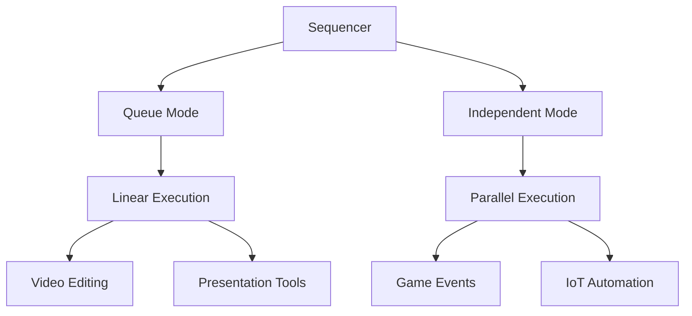

# 🎛️ @kzkymur/sequencer - Precision Timeline Orchestration

[](https://opensource.org/licenses/MIT)
[](https://www.npmjs.com/package/@kzkymur/sequencer)
[](https://github.com/kzkymur/sequencer)

[**Demo Page is Here**](https://kzkymur.github.io/sequencer/)

A professional-grade TypeScript library for precise sequencing and timeline orchestration. Perfect for animations, audio sequencing, robotic control, and any time-based operations requiring millisecond precision.



## 🌟 Why Choose Sequencer?

- **Military-Grade Precision**  
  Engineered for sub-millisecond accuracy with Web Worker timers
- **Dual Mode Architecture**  
  Choose between linear queue sequencing or parallel event execution
- **Visual Debugging**  
  Built-in Canvas visualization tools for timeline monitoring
- **Enterprise Ready**  
  Full TypeScript support and 95% test coverage

## 🚀 Getting Started

### Installation
```bash
npm install @kzkymur/sequencer
```

### Basic Usage
```typescript
import { Sequencer, Fragment } from '@kzkymur/sequencer';

// Create a pulsating light sequence
const lightShow = new Sequencer(
  100,  // pitch 
  1.0,  // speed
  true  // loop-frag
);

lightShow.push(new Fragment('Red Pulse', 500, () => setLEDColor('#ff0000')));
lightShow.push(new Fragment('Blue Pulse', 500, () => setLEDColor('#0000ff')));

// Start the light show
lightShow.play();
```

## 🧩 Core Concepts

### Queue Mode (Linear Sequencing)
```typescript
const presentation = new Sequencer(
  50,     // pitch 
  1.0,    // speed
  false   // loop-frag
);

presentation.push(new Fragment('Slide 1', 3000, showSlide1));
presentation.push(new Fragment('Transition', 500, playTransitionSound));
presentation.push(new Fragment('Slide 2', 4000, showSlide2));

presentation.play();
```

### Independent Mode (Parallel Events)
```typescript
const gameEvents = new IndependentSequencer(
  16.67,  // pitch 
  1.0,    // speed
  false   // loop-frag
);

// Parallel events with different start points
gameEvents.push(new IndependentFragment('Enemy AI', 1000, 0, updateAI));
gameEvents.push(new IndependentFragment('Physics', 16.67, 0, updatePhysics));
gameEvents.push(new IndependentFragment('Music', 5000, 250, playBackgroundScore));

gameEvents.play();
```

### Custom Fragments (Modular Sequencing)
```typescript
// Create complex animation sequence
const introAnimation = new CustomFragment('Intro', 0);
introAnimation.add(new IndependentFragment('Fade In', 1000, 0, fadeInLogo));
introAnimation.add(new IndependentFragment('Bounce', 500, 1000, animateBounce));

// Use like regular fragment
const mainSequence = new IndependentSequencer(
  16.67,  // pitch 
  1.0,    // speed
);
mainSequence.push(introAnimation);
mainSequence.play();
```

## 📚 Full API Reference

### Fragment Classes

| Class               | Description                              | Unique Features              |
|---------------------|------------------------------------------|-------------------------------|
| `Fragment`          | Base timeline unit                       | Linear execution             |
| `IndependentFragment`| Parallel execution fragment             | Start point positioning      |
| `CustomFragment`     | Group multiple fragments                 | Nested sequencing            |

### Sequencer Methods
```typescript
class Sequencer {
  constructor(pitch: number, speed: number, loop: boolean);
  
  // Core controls
  play(delay?: number): void;
  stop(delay?: number): void;
  replay(delay?: number): void;
  
  // Fragment management
  push(fragment: Fragment): void;
  remove(fragment: Fragment): void;
  insert(index: number, fragment: Fragment): void;
  
  // Visualization
  renderToCanvas(ctx: CanvasRenderingContext2D, options: RenderOptions): void;
}
```

## 🎨 Visualization Guide

```typescript
// Set up Canvas visualization
const canvas = document.getElementById('timeline-view');
const ctx = canvas.getContext('2d');

sequencer.renderToCanvas(ctx, {
  width: 800,
  height: 100,
  timeScale: 1.0,
  colorScheme: {
    active: '#4CAF50',
    upcoming: '#2196F3',
    completed: '#9E9E9E'
  }
});
```

## 🛠️ Development Setup

```bash
git clone https://github.com/kzkymur/sequencer.git
cd sequencer
npm install
npm run dev
```

## 🤝 Contributing

We welcome contributions! Please follow these guidelines:
1. Fork the repository
2. Create your feature branch (`git checkout -b feature/amazing-feature`)
3. Commit changes with semantic messages (`feat: add new fragment type`)
4. Push to the branch (`git push origin feature/amazing-feature`)
5. Open a Pull Request

## 📜 License
Distributed under the MIT License. See `LICENSE` for more information.

## 💡 Real-World Applications
- Robotic arm control sequences
- Interactive museum exhibits
- Live performance lighting systems
- Automated video editing pipelines
- Industrial process automation

## ⚠️ Troubleshooting

**Q:** My callbacks aren't firing at expected times  
**A:** Ensure your pitch value divides evenly into fragment durations

**Q:** Visualizations appear choppy  
**A:** Match the render loop to your screen refresh rate (typically 60Hz = 16.67ms pitch)